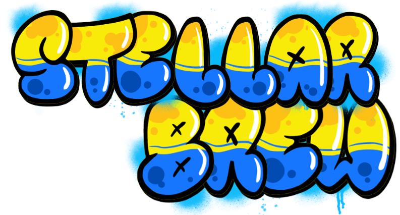

  

  
Table of Contents

  <ol>
    <li><a href="#project-description">Project description</a></li>
    <li><a href="#the-github-repository">The github repository</a></li>
    <li>
      <a href="#the-game">How to play</a>
      <ul>
        <li><a href="#growing-hops">Growing hops</a></li>
        <li><a href="#water-maker">Water maker</a></li>
        <li><a href="#beer-brewing">Beer brewing</a></li>
        <li><a href="#sales-hall">Sales hall</a></li>
        <li><a href="#spaceship">Spaceship</a></li>
      </ul>
    </li>
  </ol>

## **Project description**

The aim of this project was to create a small game using **Unity3D** in less than a week, without any knowledge of the software, in order to discover **C#** and **Unity3D**. 
The aim is not to make a big game, but a small, playable one. 

Everything was done by myself, except :

- The music (royalty-free).
- Graphic assets.

## **The github repository**

This repository includes only the data needed to run the final game. In addition, it uses the **Git LFS** system on the files listed in the **.gitattributes**. 
To avoid incomplete file errors, use the versions given in the release tab.

## **The game**

In this **arcade-style game**, you're placed in a space base, where your sole aim is to produce beer to meet demand.

### **Keys**

To control the character use the **mouse** and the **[zqsd]** key for azerty keyboards or **[wqsd]** for qwerty keyboards. 
Interact with elements using the **[e]** key. 
You can access the settings menu at any time by pressing the **[t]** key.

### **Economy**

Every **60 seconds** a day goes by and you lose **700 money**.

### **Game over**

The game ends when your **economy goes negative**.

### **How to play**  

#### **Growing hops**

To grow hops you need to interact with the greenhouse monitor. You can use it to add water to the crop, and set the temperature. Note that changing the temperature consumes **30 water**.

| Temperature 	| Water consumption 	| Grow time 
|-------------	|-------------------	|-----------
| x1          	| 15                	| 60sec     
| x1.5        	| 24                	| 45sec     
| x2          	| 30                	| 30sec     

To harvest the production, interact with one of the cultivation tray. 
Hop production per tray corresponds to this table.

| Grow level 	| Hop quantity 
|------------	|--------------
| 1         	| 30           
| 2       	  | 50           
| 3        	  | 70           
| 4        	  | 110           

(<a href="#project-description">back to top</a>)

#### **Water maker**

To collect water, exit the base via the decompression airlock.

Then interact with the water maker. You can visually see how much water it contains. Note that you can only transport **100 units of water**.

(<a href="#project-description">back to top</a>)

#### **Beer brewing**

When you're in the main dome, you have access to three vats of beer (blonde, red, IPA).

Each of these three tanks behaves in the same way. 
Interact with one of them via its monitor. 
Thanks to the monitor, you can place hops from your inventory in each tank, which can hold up to **500 hops**. 
You can also use this menu to retrieve a beer from the vat, although you can only carry one of each type at a time.

To create one beer, you'll need **50 hops** and you can only start brewing when the tank has run out of beer. This process takes **60sec** and converts the hops into beer.

(<a href="#project-description">back to top</a>)

#### **Sales hall**

To sell your beer you have to go to the sales hall. Every **90sec** the sales hall will offer you a new type of beer. Bring him a copy to be rewarded with **800 money**.

(<a href="#project-description">back to top</a>)

#### **Spaceship**

You can take your surplus beer to the spatical vessel outside your base. Once you've dropped off 5 beers of any type, it will sell them for **700 money** and return after **90sec**.

(<a href="#project-description">back to top</a>)
